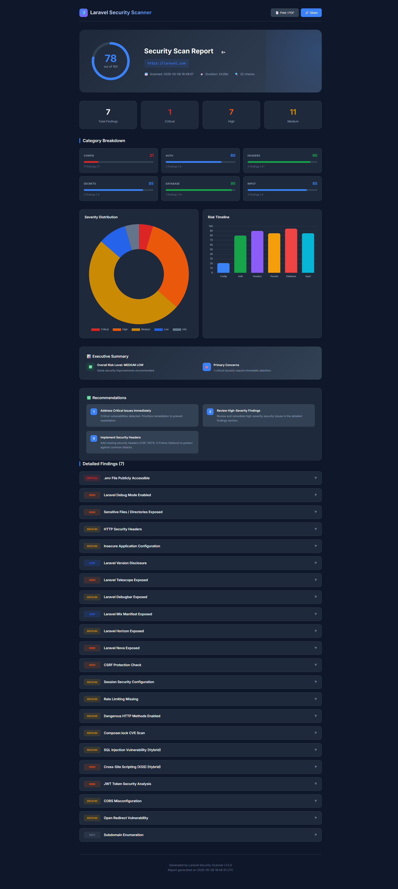

# Laravel Security Scanner

[](https://pypi.org/project/laravel-security-scanner/)
[](https://pypi.org/project/laravel-security-scanner/)
[](https://github.com/AlgoDev/Laravel-Security-Scanner/actions)
[](https://github.com/AlgoDev/Laravel-Security-Scanner/actions)
[](https://pypi.org/project/laravel-security-scanner/)
[](https://github.com/AlgoItDev/Laravel-Security-Scanner/)
[](https://github.com/AlgoItDev/Laravel-Security-Scanner/)


Production-grade Python CLI tool for auditing Laravel web applications for common security misconfigurations.



## What It Checks

| Check ID | Title | Severity |
|---|---|---|
| `ENV_EXPOSED` | .env file publicly accessible | CRITICAL |
| `DEBUG_MODE` | Laravel debug mode enabled | HIGH |
| `SENSITIVE_FILES` | Sensitive files/directories exposed | HIGH |
| `SECURITY_HEADERS` | Missing HTTP security headers | MEDIUM |
| `INSECURE_CONFIG` | CORS, cookie flags, server headers | MEDIUM |
| `LARAVEL_VERSION` | Laravel version disclosure | MEDIUM |
| `TELESCOPE_EXPOSED` | Laravel Telescope exposed | HIGH |
| `DEBUGBAR_EXPOSED` | Laravel Debugbar exposed | MEDIUM |
| `MIX_MANIFEST_EXPOSED` | Laravel Mix manifest exposed | LOW |
| `HORIZON_EXPOSED` | Laravel Horizon exposed | MEDIUM |
| `NOVA_EXPOSED` | Laravel Nova exposed | HIGH |
| `CSRF_PROTECTION` | CSRF protection missing | HIGH |
| `SESSION_SECURITY` | Session security configuration | MEDIUM |
| `RATE_LIMITING` | Rate limiting missing | MEDIUM |
| `HTTP_METHODS` | Dangerous HTTP methods enabled | MEDIUM |
| `COMPOSER_CVE` | Composer.lock CVE scan (OSV API + local DB) | CRITICAL |
| `SQL_INJECTION` | SQL Injection (AST-based) | CRITICAL |
| `XSS` | Cross-Site Scripting (Hybrid) | HIGH |
| `COMMAND_INJECTION` | Command Injection (AST-based) | CRITICAL |
| `DESERIALIZATION` | Deserialization (AST-based) | CRITICAL |

> **Note**: `SQL_INJECTION` uses AST-based taint tracking for accurate detection. `COMMAND_INJECTION` and `DESERIALIZATION` are NEW in v1.5.0.
| `JWT_ANALYSIS` | JWT token security issues | HIGH |
| `CORS_MISCONFIG` | CORS misconfiguration | MEDIUM |
| `OPEN_REDIRECT` | Open redirect vulnerability | MEDIUM |
| `SUBDOMAIN_ENUM` | Subdomain enumeration | LOW |

## Project Structure

```
laravel-security-scanner/
├── app/
│   ├── core/
│   │   ├── settings.py        # Pydantic settings + .env loader
│   │   └── logging.py         # Loguru structured logging
│   ├── models/
│   │   └── scan.py            # ScanTarget, Finding, ScanResult models
│   ├── services/
│   │   ├── scanner.py         # ScannerService — async orchestrator
│   │   ├── reporter.py        # Console / JSON / TXT / HTML / SARIF report generator
│   │   ├── rate_limiter.py    # RateLimiter & RetryableClient
│   │   └── checks/
│   │       ├── base.py        # BaseCheck abstract class
│   │       ├── __init__.py    # Check registry (ALL_CHECKS)
│   │       ├── env_exposed.py
│   │       ├── debug_mode.py
│   │       ├── security_headers.py
│   │       ├── sensitive_files.py
│   │       ├── insecure_config.py
│   │       ├── laravel_version.py
│   │       ├── telescope_exposed.py
│   │       ├── debugbar_exposed.py
│   │       ├── mix_manifest_exposed.py
│   │       ├── horizon_exposed.py
│   │       ├── nova_exposed.py
│   │       ├── csrf_protection.py
│   │       ├── session_security.py
│   │       ├── rate_limiting.py
│   │       ├── http_methods.py
│   │       ├── composer_lock_cve.py
│   │       ├── sql_injection.py    # Hybrid (static + dynamic)
│   │       └── xss.py             # Hybrid (static + dynamic)
│   ├── source_fetcher.py      # Auto-detect source code (GitHub/Web)
│   ├── static_analyzer.py    # Static code pattern analysis
│   └── php_ast_analyzer.py  # AST-based taint tracking (v1.5.0)
│   └── utils/
│       └── url.py             # URL normalisation
├── tests/
│   └── unit/
│       ├── test_models.py
│       ├── test_url_utils.py
│       ├── test_env_check.py
│       ├── test_laravel_version.py
│       ├── test_telescope_exposed.py
│       ├── test_debugbar_exposed.py
│       ├── test_mix_manifest_exposed.py
│       ├── test_horizon_exposed.py
│       ├── test_nova_exposed.py
│       ├── test_csrf_protection.py
│       ├── test_session_security.py
│       ├── test_rate_limiting.py
│       ├── test_http_methods.py
│       └── test_composer_lock_cve.py
├── .github/
│   └── workflows/
│       └── security.yml         # GitHub Actions Security Scan
├── logs/
├── reports/
├── cve_database.json            # Local CVE database for composer scan
├── osv_cache.json               # OSV API cache (auto-generated)
├── .env.example
├── requirements.txt
├── pytest.ini
├── CHANGELOG.md
├── VERSION
└── main.py
```

## Installation

### Via PyPI (Recommended)

```bash
pip install laravel-security-scanner
```

### Via Source

```bash
# 1. Clone / download
git clone https://github.com/AlgoDev/Laravel-Security-Scanner.git
cd laravel-security-scanner

# 2. Create virtualenv
python3.11 -m venv .venv
source .venv/bin/activate   # Windows: .venv\Scripts\activate

# 3. Install dependencies
pip install -r requirements.txt

# 4. Configure
cp .env.example .env
# Edit .env as needed
```

## Usage

```bash
# Scan a single target (all formats)
laravel-sec-scanner https://your-laravel-app.com

# Or using Python directly
python main.py https://your-laravel-app.com

# Multiple targets
laravel-sec-scanner https://app1.com https://app2.com

# JSON report only
laravel-sec-scanner https://app.com --format json --output ./my-reports

# HTML report only
laravel-sec-scanner https://app.com --format html --output ./my-reports

# SARIF report for GitHub Security tab
laravel-sec-scanner https://app.com --format sarif --output ./my-reports

# Skip SSL verification (e.g. staging with self-signed cert)
laravel-sec-scanner https://staging.app.com --no-ssl-verify

# Set custom timeout
laravel-sec-scanner https://app.com --timeout 20

# Run specific checks only
laravel-sec-scanner https://app.com --checks ENV_EXPOSED,DEBUG_MODE,COMPOSER_CVE

# Set OSV cache TTL (default: 24 hours, 0 to disable)
laravel-sec-scanner https://app.com --cache-ttl 168
```

## Features

- **OSV API Integration**: Hybrid CVE scanning (local database + OSV.dev API)
- **Multiple Output Formats**: Console, JSON, TXT, HTML, and SARIF reports
- **Progress Bar**: Real-time progress tracking with rich library during scans
- **CI/CD Integration**: GitHub Actions workflow included (`.github/workflows/security.yml`)
- **Async Scanning**: Concurrent checks for faster results
- **Comprehensive Checks**: 22 security checks covering critical Laravel vulnerabilities
- **SARIF Support**: SARIF format output for GitHub Security tab integration
- **Rate Limiting**: Built-in rate limiter to avoid overwhelming target servers
- **Retry Mechanism**: Automatic retry for failed requests with exponential backoff
- **Connection Pooling**: HTTP connection reuse for better performance
- **Check Selection**: Use `--checks` to run specific checks only
- **OSV Cache**: File-based cache with configurable TTL for offline scanning
- **Progressive Exit Codes**: 0-4 based on severity for CI/CD pipelines
- **Fail-on Threshold**: `--fail-on critical` for GitHub Actions integration

- **AI-Powered Fix Suggestions** (Future Plan):
  - Detailed step-by-step remediation instructions
  - Laravel code examples (correct vs incorrect patterns)
  - Nginx/Apache configuration examples
  - CLI commands for verification
  - Multiple solution options per vulnerability
  - Emoji-based severity indicators

## Running Tests

```bash
# Install dev dependencies
pip install laravel-security-scanner[dev]

# Run tests
pytest tests/unit/ -v
pytest tests/ -v --tb=short   # all tests
```

**Current Test Coverage**: 102 tests passing

## AST-Based Analysis (v1.5.0)

This version introduces **true static code analysis** using PHP AST parser:

### How AST Analysis Works

```php
// ANALYZED CODE:
$id = $_GET['id'];           // SOURCE → $id is TAINTED
$query = "SELECT * ..." . $id; // PROPAGATION → $query is TAINTED  
DB::select($query);         // SINK → VULNERABLE!
```

1. **Parse PHP Code**: phply parses code into AST nodes
2. **Taint Tracking**: 
   - Find INPUT sources: `$_GET`, `$_POST`, `$_COOKIE`
   - Track variable assignments
   - Follow data flow (concatenation, operations)
3. **Sink Detection**:
   - Dangerous functions: `DB::select`, `system`, `unserialize`
   - Check if parameters are tainted
4. **Report**: High-confidence vulnerability findings

### What AST Detects

| Vulnerability | Example | Confidence |
|-------------|---------|------------|
| SQL Injection | `DB::select($query)` where $query = ... . $input | 90% |
| Command Injection | `system($cmd)` | 95% |
| Deserialization | `unserialize($data)` from cookie | 95% |
| Code Execution | `eval($code)` | 98% |
| File Inclusion | `include($file)` | 85% |

### Why AST is Better Than Regex

- **False Positives**: No more! Parameterized queries are SAFE
- **Data Flow**: Tracks tainted input through variables
- **Structure**: Understands PHP syntax, not guessing

## False Positive Reduction

This tool uses **hybrid static + dynamic analysis** to minimize false positives:

### How It Works

1. **Static Analysis**: Fetches source code from:
   - Web-accessible files (routes, config, controllers)
   - GitHub repository (auto-detected from target URL)
   - Analyzes code patterns for dangerous usage

2. **Dynamic Probing**: Tests endpoints with payloads:
   - SQL injection payloads for SQL injection check
   - XSS payloads for XSS check
   - Analyzes application responses

3. **Confidence Scoring**: Combines results:
   - Static DANGER + Dynamic VULN = **95%** confidence
   - Static DANGER = **60%** confidence
   - Dynamic VULN only = **40%** confidence (WAF bypass possible)
   - No findings = **SAFE**

## Security Score System

This tool provides a **comprehensive security score** (0-100) based on findings:

### Categories

| Category | Checks | Weight |
|-----------|--------|--------|
| Config | ENV_EXPOSED, DEBUG_MODE, LARAVEL_VERSION, SENSITIVE_FILES | 1.2x |
| Auth | CSRF_PROTECTION, SESSION_SECURITY, RATE_LIMITING | 2.0x |
| Headers | SECURITY_HEADERS, CORS_MISCONFIG | 1.0x |
| Secrets | COMPOSER_CVE, JWT_ANALYSIS, SUBDOMAIN_ENUM | 1.5x |
| Database | SQL_INJECTION | 2.0x |
| Input | XSS, OPEN_REDIRECT | 1.5x |

### Scoring Formula

```
Base: 100 points
- CRITICAL: -15 points each
- HIGH: -10 points each
- MEDIUM: -5 points each
- LOW: -2 points each
```

### Grade System

| Score | Grade | Risk Level |
|-------|-------|------------|
| 90-100 | A+ | Very Low |
| 80-89 | A | Low |
| 70-79 | B+ | Medium-Low |
| 60-69 | B | Medium |
| 50-59 | C | Medium-High |
| 40-49 | D | High |
| 0-39 | F | Critical |

### Example Output

```
Security Score : 72/100 [B+]
Risk Level      : MEDIUM

CONFIG    ████████░░ 80/100 [B+]
AUTH      ██████████ 100/100 [A+]
HEADERS   ██████░░░░░ 60/100 [D]
SECRETS  ██████████ 100/100 [A+]
DATABASE ████░░░░░░░ 40/100 [F]
```

### False Positive Examples

| Code Pattern | Old Behavior | New Behavior |
|--------------|-------------|--------------|
| `DB::select("SELECT * FROM users")` | VULNERABLE (SQL error) | SAFE (no concat, no input) |
| `DB::select("SELECT * " . $input)` | VULNERABLE | VULNERABLE (confirmed) |
| `{{ $var }}` (Blade) | VULNERABLE | SAFE (auto-escaped) |
| `{!! $var !!}` (Blade raw) | VULNERABLE | VULNERABLE (raw output) |

## Adding a New Check

1. Create `app/services/checks/my_check.py` extending `BaseCheck`
2. Implement `async def run(self, target: ScanTarget) -> Finding`
3. Register in `app/services/checks/__init__.py -> ALL_CHECKS`

That's it — the `ScannerService` picks it up automatically.

## Exit Codes

| Code | Meaning |
|---|---|
| `0` | Clean - no vulnerabilities found |
| `1` | Low/Info vulnerabilities found |
| `2` | Medium vulnerabilities found |
| `3` | High vulnerabilities found |
| `4` | Critical vulnerabilities found |
| `5` | Scan error or failure |

### CI/CD Usage

```bash
# Basic usage - exit 1 if ANY vulnerability
laravel-sec-scanner https://app.com

# Fail on critical only
laravel-sec-scanner https://app.com --fail-on critical

# Fail on high or above
laravel-sec-scanner https://app.com --fail-on high
```

GitHub Actions example:
```yaml
- name: Security Scan
  run: laravel-sec-scanner ${{ vars.TARGET_URL }} --fail-on critical
```

## Changelog

See [CHANGELOG.md](CHANGELOG.md) for detailed version history.

## Version

Current version: **v1.5.0** (see [VERSION](VERSION) file)

---

**Total Security Checks**: 22
**AST-Based Analysis**: True PHP code analysis with taint tracking
**Security Score**: Category-based 0-100 scoring system with grades
**Output Formats**: 5 (Console, JSON, TXT, HTML, SARIF)
**Tests**: 102 passing
**CI/CD**: GitHub Actions ready